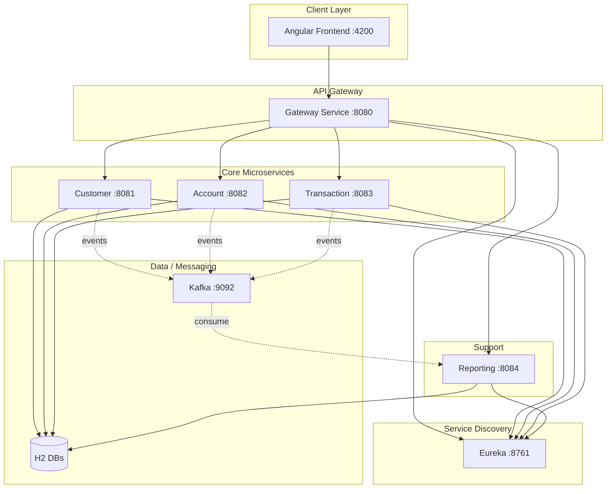
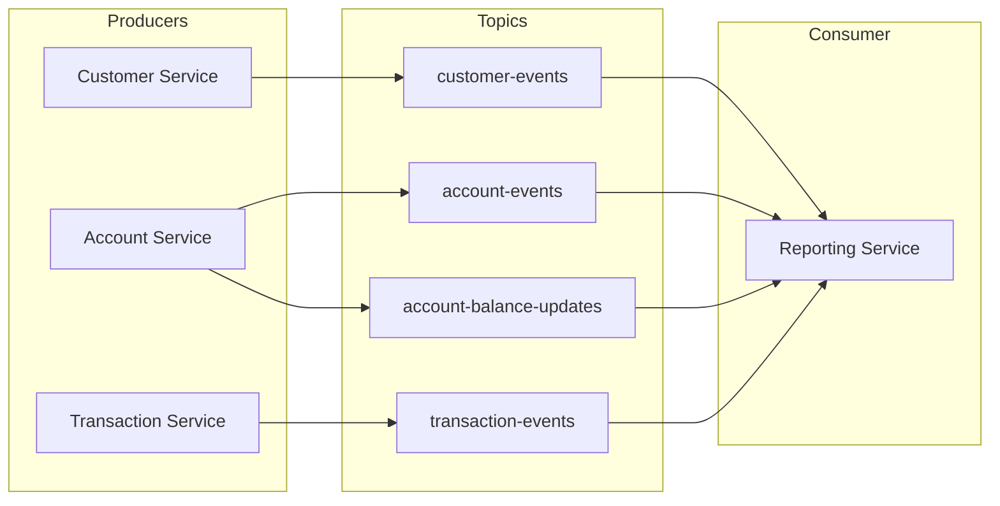
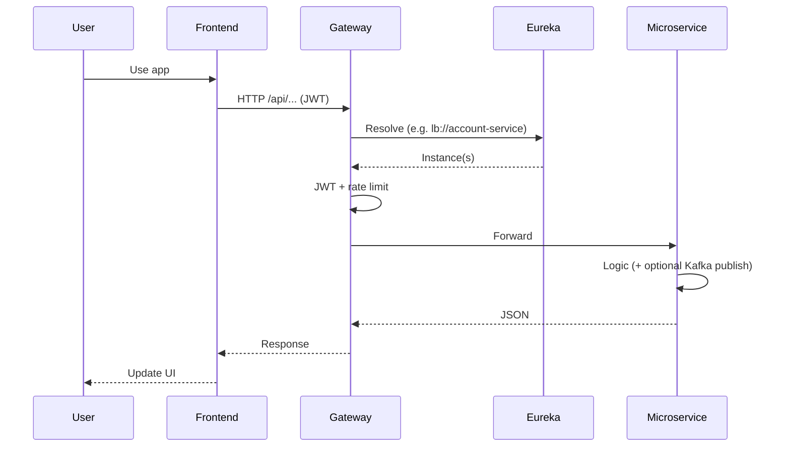

# E-Bank – Microservices

Full-stack digital banking with **Spring Boot** microservices, **Angular** frontend, **Kafka** for events, and **Eureka** for service discovery.

---

## Table of contents

- [Architecture overview](#architecture-overview)
- [Services](#services)
- [Kafka & event-driven architecture](#kafka--event-driven-architecture)
- [Eureka (service discovery)](#eureka-service-discovery)
- [Docker (Kafka)](#docker-kafka)
- [Request flow](#request-flow)
- [Service arborescence](#service-arborescence)
- [Mermaid diagram files](#mermaid-diagram-files)
- [Quick start](#quick-start)

---

## Architecture overview

The app is composed of:

- **Frontend** (Angular) → talks to **API Gateway**
- **Gateway** → routes to microservices using **Eureka** (load balancing)
- **Microservices** → each has its own H2 DB; some **produce** events to **Kafka**
- **Reporting service** → **consumes** Kafka events from all domains



---

## Services

| Service                 | Port | Role                                                                                                     |
| ----------------------- | ---- | -------------------------------------------------------------------------------------------------------- |
| **discovery-service**   | 8761 | Eureka server: registry of all microservices. Others register here and the gateway discovers instances.  |
| **gateway-service**     | 8080 | API Gateway: single entry point, JWT validation, rate limiting, routes `/api/*` to the right service.    |
| **customer-service**    | 8081 | Users, auth (login/register), customers. Produces **customer-events** to Kafka.                          |
| **account-service**     | 8082 | Bank accounts (current/saving). Produces **account-events** and **account-balance-updates**.             |
| **transaction-service** | 8083 | Credit, debit, transfer; operation history. Has **TransactionEventProducer** for **transaction-events**. |
| **reporting-service**   | 8084 | Dashboards, stats. **Consumes** all Kafka topics (customer, account, balance, transaction).              |

**Flow in short:**  
Frontend → Gateway → Eureka (resolve) → one of the services. Customer/Account/Transaction services publish events to Kafka; Reporting service subscribes and maintains database projections for dashboards and reports.

---

## Kafka & event-driven architecture

### What is Kafka?

**Kafka** is a message broker: services **produce** messages to **topics**, and other services **consume** them. Here it is used for **event-driven communication** (EDA): when something important happens (e.g. “customer created”, “balance updated”), the service that did it publishes an event; others can react without direct HTTP calls.

### Zookeeper

Kafka uses **Zookeeper** for cluster metadata (broker list, topic config). In this project, **Docker** runs both:

- **Zookeeper** (port 2181) – started first
- **Kafka** (port 9092) – depends on Zookeeper

You don’t write Zookeeper code; it’s infrastructure for Kafka.

### Who is producer and who is consumer?

| Role         | Service             | Topic(s)                                    |
| ------------ | ------------------- | ------------------------------------------- |
| **Producer** | customer-service    | `customer-events`                           |
| **Producer** | account-service     | `account-events`, `account-balance-updates` |
| **Producer** | transaction-service | `transaction-events`                        |
| **Consumer** | reporting-service   | All four topics above                       |

- **Producers:** domain producers write durable outbox records; relays send their JSON payloads to Kafka and retry failed deliveries.
- **Consumer:** `DomainEventListeners` uses `@KafkaListener` to update SQL projections, deduplicating event IDs and rejecting stale snapshots.

Kafka is **optional**: if `app.kafka.enabled=false` (default in many profiles), producers no-op and the app works without Kafka.

### EDA in this project

- **Customer created** → customer-service publishes to `customer-events` → reporting can log/aggregate.
- **Account created / balance updated** → account-service publishes to `account-events` and `account-balance-updates` → reporting consumes.
- **Transaction events** → transaction-service can publish to `transaction-events` → reporting consumes.

So: **event-driven** = “something happened” is published once; **reporting-service** is the main **event consumer** that sees all domain events.



---

## Eureka (service discovery)

- **Eureka** is the **service registry**: each microservice (customer, account, transaction, reporting, etc.) **registers** itself with Eureka on startup and sends heartbeats.
- **Gateway** uses Eureka to **discover** instances: when a request hits `/api/accounts/...`, the gateway asks Eureka “who is `account-service`?” and gets one or more instances, then forwards the request (load balancing).
- Config: `eureka.client.service-url.defaultZone=http://localhost:8761/eureka/` (or `http://discovery-service:8761/eureka/` in Docker).
- **Discovery-service** does **not** register itself with Eureka (`register-with-eureka=false`); it **is** the server.

So: **Eureka implemented** = one discovery-service (Eureka server) + all other services as Eureka clients that register and are discovered by the gateway.

---

## Docker (Kafka)

The full application runs with `docker-compose.yml`:

```bash
docker compose -p e-bank up -d --build
```

Open http://localhost:4200. The gateway is at http://localhost:18080,
Eureka at http://localhost:18761 and Kafka UI at http://localhost:19090.
Ports bind to loopback and can be overridden using the variables in Compose.
The full Compose setup enables demo accounts (`admin` and `marie.dupont`,
password `password`). Account, customer, transaction, reporting and Kafka data
are stored in named volumes. `docker compose -p e-bank down` preserves them;
`down -v` removes them and resets the demo.

Profile photos use direct unsigned uploads to Cloudinary. Set the Cloudinary
cloud name and unsigned upload preset in the Angular environment files before
enabling the photo picker; the returned HTTPS URL is persisted on the user
profile, so the banking services never store image binaries.

Money commands accept an `Idempotency-Key`. Reuse the same key and request after
an uncertain response; a changed request with the same key is rejected. The UI
retains pending keys in session storage. Account balance changes and their outbox
events commit together. Reporting consumes events into its own persistent database
and exposes `projectionUpdatedAt` and `projectionStatus` to describe freshness.

See [integration validation](docs/testing/integration-validation.md) for the
isolated desktop/mobile browser suite and Kafka outage recovery check.

For the Kafka infrastructure alone:

**File:** `docker-compose-kafka.yml`

- **zookeeper** – image `confluentinc/cp-zookeeper:7.5.0`, port 2181.
- **kafka** – image `confluentinc/cp-kafka:7.5.0`, port 9092, connects to `zookeeper:2181`.

**Usage:**

```bash
docker compose -f docker-compose-kafka.yml up -d
```

Then set `KAFKA_BOOTSTRAP_SERVERS=localhost:9092` and run the microservices with the `kafka` profile so they use Kafka. The script `run-with-kafka.sh` starts Docker Kafka first, then builds and runs the services with the kafka profile.

---

## Request flow

High-level: **User → Frontend → Gateway → Eureka → Microservice → Response**.



---

## Service arborescence

Below is the **folder/file layout** for each microservice (main sources and config; `target/` omitted).

### discovery-service

```
discovery-service/
├── pom.xml
└── src/main/
    ├── java/.../discovery/DiscoveryServiceApplication.java
    └── resources/application.properties
```

### gateway-service

```
gateway-service/
├── pom.xml
└── src/main/
    ├── java/.../gateway/
    │   ├── GatewayServiceApplication.java
    │   ├── config/CorsConfig.java, GatewayConfig.java
    │   └── filter/JwtAuthenticationFilter.java, RateLimitingFilter.java
    └── resources/application.properties, application-kafka.properties
```

### customer-service

```
customer-service/
├── pom.xml
└── src/main/
    ├── java/.../customer/
    │   ├── CustomerServiceApplication.java
    │   ├── clients/AccountServiceClient.java, TransactionServiceClient.java
    │   ├── config/DemoDataLoader.java, SecurityConfig.java
    │   ├── controllers/AuthController.java, CustomerController.java,
    │   │         CustomerExportController.java, CustomerPortalController.java
    │   ├── dtos/ (AuthResponse, CustomerDTO, LoginRequest, etc.)
    │   ├── entities/Customer.java, User.java
    │   ├── enums/Role.java
    │   ├── events/CustomerCreatedEvent.java
    │   ├── messaging/CustomerEventProducer.java
    │   ├── repositories/CustomerRepository.java, UserRepository.java
    │   ├── security/JwtAuthenticationFilter.java
    │   └── services/AuthService.java, CustomerService.java,
    │             CustomUserDetailsService.java, JwtService.java
    └── resources/application.properties, application-kafka.properties
```

### account-service

```
account-service/
├── pom.xml
└── src/main/
    ├── java/.../account/
    │   ├── AccountServiceApplication.java
    │   ├── clients/CustomerServiceClient.java, FeignClientConfig.java, fallbacks
    │   ├── config/AccountDemoDataLoader.java, ResilienceConfig.java
    │   ├── controllers/AccountController.java, AccountExportController.java
    │   ├── dtos/ (BankAccountDTO, CreateAccountRequest, Current/Saving DTOs)
    │   ├── entities/BankAccount.java, CurrentAccount.java, SavingAccount.java
    │   ├── enums/AccountStatus.java
    │   ├── events/AccountBalanceUpdatedEvent.java, AccountCreatedEvent.java
    │   ├── messaging/AccountEventProducer.java
    │   ├── repositories/BankAccountRepository.java
    │   ├── services/AccountService.java
    │   └── exceptions/ (GlobalExceptionHandler, etc.)
    └── resources/application.properties, application-kafka.properties
```

### transaction-service

```
transaction-service/
├── pom.xml
└── src/main/
    ├── java/.../transaction/
    │   ├── TransactionServiceApplication.java
    │   ├── clients/AccountServiceClient, CustomerServiceClient, FeignClientConfig, fallbacks
    │   ├── config/ResilienceConfig.java, TransactionDemoDataLoader.java
    │   ├── controllers/TransactionController.java
    │   ├── dtos/AccountOperationDTO.java, TransactionRequest.java, TransferRequest.java
    │   ├── entities/AccountOperation.java
    │   ├── enums/OperationType.java
    │   ├── messaging/TransactionEvent.java, TransactionEventProducer.java
    │   ├── repositories/AccountOperationRepository.java
    │   ├── services/TransactionService.java
    │   └── exceptions/ (GlobalExceptionHandler, etc.)
    └── resources/application.properties, application-kafka.properties
```

### reporting-service

```
reporting-service/
├── pom.xml
└── src/main/
    ├── java/.../reporting/
    │   ├── ReportingServiceApplication.java
    │   ├── clients/AccountServiceClient, CustomerServiceClient, TransactionServiceClient, fallbacks
    │   ├── controllers/ReportingController.java
    │   ├── messaging/DomainEventListeners.java   ← Kafka consumers
    │   └── services/ReportingService.java
    └── resources/application.properties, application-kafka.properties
```

---

## Mermaid diagram files

Mermaid diagram sources are in the **`docs/`** folder. You can edit or render them in [Mermaid Live Editor](https://mermaid.live) or any Mermaid-capable tool.

| File                                                                         | Description                                                               |
| ---------------------------------------------------------------------------- | ------------------------------------------------------------------------- |
| [docs/mermaid-architecture.mmd](docs/mermaid-architecture.mmd)               | High-level architecture (frontend, gateway, Eureka, services, Kafka, H2). |
| [docs/mermaid-kafka-microservices.mmd](docs/mermaid-kafka-microservices.mmd) | Kafka producers, topics, and reporting-service as consumer.               |
| [docs/mermaid-general-flow.mmd](docs/mermaid-general-flow.mmd)               | General request flow (user → frontend → gateway → Eureka → service).      |

The same files are also at the repo root (`mermaid-architecture.mmd`, `mermaid-kafka-microservices.mmd`, `mermaid-general-flow.mmd`) for convenience.

---

## Quick start

**Without Kafka (default):**  
Start discovery, then gateway, then customer, account, transaction, reporting. Frontend: `npm start` in `frontend/`. Use gateway base URL (e.g. `http://localhost:8080`) from the frontend.

**With Kafka:**

1. Start Kafka (and Zookeeper):  
   `docker compose -f docker-compose-kafka.yml up -d`
2. Run the script that builds and starts everything with the `kafka` profile:  
   `./run-with-kafka.sh`  
   (It sets `SPRING_PROFILES_ACTIVE=kafka` and `KAFKA_BOOTSTRAP_SERVERS=localhost:9092`.)

**Useful URLs:**

- Eureka: http://localhost:8761
- Gateway: http://localhost:8080
- Frontend: http://localhost:4200
- Kafka: localhost:9092

---

## Default credentials

- **Admin:** `admin` / `password`
- **Customer:** e.g. `marie.dupont` / `password`

(Seeded by demo data loaders in customer-service, account-service, transaction-service when using in-memory H2.)
